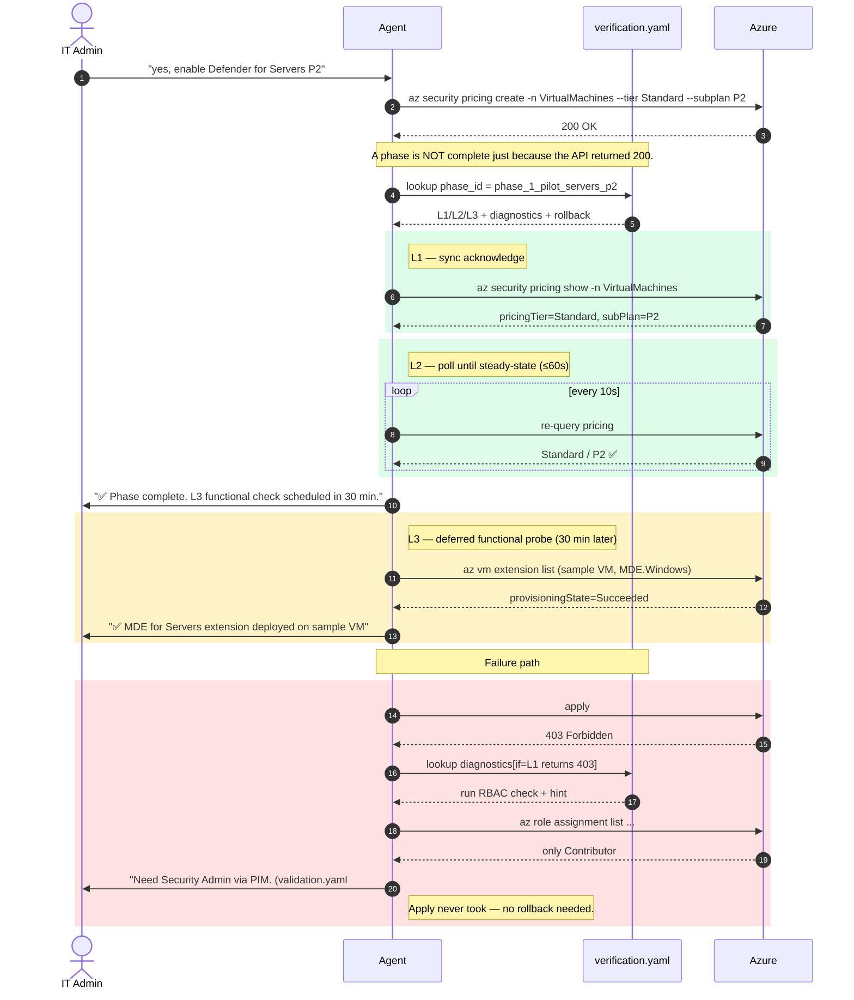

# Deployment Assistant — Architecture Diagram

A low-level, easy-to-read view of the tool. Three diagrams: **components**, **per-turn data flow**, **per-pillar runtime sequence**.

---

## 1 · Component diagram (what's in the repo, who reads what)

```mermaid
flowchart TB
    subgraph user["👤 IT Admin"]
      U[Conversation in Copilot Chat]
    end

    subgraph runtime["RUNTIME LAYER  (Copilot loads at chat time)"]
      direction TB
      CI[".github/copilot-instructions.md<br/>🔀 router"]
      ORCH["agents/orchestrator.md<br/>shared persona + rules"]
      AGT["agents/&lt;product&gt;-deployment.md<br/>per-product persona"]
      SKL["skills/&lt;product&gt;/SKILL.md<br/>skill registration"]
      INST[".github/instructions/&lt;product&gt;/*.md<br/>workshop phases, ARG queries, pricing"]
    end

    subgraph spec["SPEC LAYER  (machine-readable source of truth)"]
      direction TB
      AG["AGENTS.md<br/>📜 4-pillar contract"]
      SK["spec/&lt;product&gt;/skill.md<br/>mental model"]
      VAL["spec/&lt;product&gt;/validation.yaml<br/>Pillars 1+2 (detect/infer/ask)"]
      LIC["spec/&lt;product&gt;/license-matrix.yaml<br/>licence ↔ feature map"]
      PRE["spec/&lt;product&gt;/preflight.md<br/>read-only az/Graph cmds"]
      PLAY["spec/&lt;product&gt;/playbook.md<br/>Pillar 3 phased deploy"]
      VER["spec/&lt;product&gt;/verification.yaml<br/>Pillar 4 L1/L2/L3 + rollback"]
    end

    subgraph azure["☁️ Customer's Azure / M365"]
      ARM[Azure Resource Manager]
      GRAPH[Microsoft Graph]
      ARG[Azure Resource Graph]
      MDC[MDC / Defender plans]
    end

    U -->|"prompt"| CI
    CI -->|"matches keywords"| AGT
    AGT -->|"inherits"| ORCH
    AGT -->|"loads"| SKL
    AGT -->|"references"| INST

    AG -.canonical contract.-> ORCH
    SK -.spec backs.-> SKL
    VAL -.spec backs.-> INST
    LIC -.spec backs.-> INST
    PRE -.spec backs.-> INST
    PLAY -.spec backs.-> INST
    VER -.spec backs.-> INST

    AGT -->|"az / graph / REST"| ARM
    AGT -->|"az / graph / REST"| GRAPH
    AGT -->|"az graph query"| ARG
    AGT -->|"enable / verify"| MDC

    classDef spec fill:#e8f4ff,stroke:#0078d4,stroke-width:1px
    classDef runtime fill:#fff4e6,stroke:#d97706,stroke-width:1px
    classDef azure fill:#f3e8ff,stroke:#7c3aed,stroke-width:1px
    class AG,SK,VAL,LIC,PRE,PLAY,VER spec
    class CI,ORCH,AGT,SKL,INST runtime
    class ARM,GRAPH,ARG,MDC azure
```

**Reading this:**
- 🔵 **Spec layer** = source of truth. One change here = one source for every runtime.
- 🟠 **Runtime layer** = what Copilot actually reads in a session. Currently hand-mirrored from spec; could be auto-generated.
- 🟣 **Customer cloud** = the only "live" external system. All writes to it must pass Pillar 3 confirmation + Pillar 4 verify.

---

## 2 · Per-turn data flow (what happens on every user message)

```mermaid
flowchart LR
    IN["💬 user message"] --> ROUTE{"router<br/>matches product?"}
    ROUTE -->|"no"| ASK1["ask:<br/>which product?"]
    ROUTE -->|"yes"| LOAD["load spec/&lt;p&gt;/*<br/>+ AGENTS.md contract"]

    LOAD --> P1{"Pillar 1<br/>complete?"}
    P1 -->|"no"| OPEN["1 opener question<br/>extracts: model, goal, fear, scope"]
    OPEN --> RF{"red flag?"}
    RF -->|"yes - misconception"| FIX["deliver<br/>corrective_message"]
    RF -->|"yes - wrong product"| REDIRECT["🛑 STOP<br/>recommend correct product"]
    RF -->|"no"| P1OK[gate_p1 ✅]

    P1 -->|"yes"| P2{"Pillar 2<br/>complete?"}
    FIX --> P2
    P1OK --> P2

    P2 -->|"no"| DETECT["run preflight cmds<br/>detect → infer → maybe ask"]
    DETECT --> XREF["cross-ref license-matrix.yaml<br/>✅ have / ✅ entitled / ⚠️ need to buy"]
    XREF --> BLOCK{"any high<br/>blocker?"}
    BLOCK -->|"yes"| MITIG["surface mitigation<br/>(PIM, network, budget)"]
    BLOCK -->|"no"| P2OK[gate_p2 ✅]

    P2 -->|"yes"| P3{"Pillar 3<br/>more phases?"}
    MITIG --> P3
    P2OK --> P3

    P3 -->|"yes"| PROPOSE["propose next phase<br/>print cmd + scope + cost + rollback"]
    PROPOSE --> CONFIRM{"user<br/>confirms?"}
    CONFIRM -->|"no"| END1["session done<br/>or pause"]
    CONFIRM -->|"yes"| APPLY["execute apply cmd"]

    APPLY --> P4["🔬 Pillar 4 VERIFY"]
    P4 --> L1{"L1 sync<br/>API accepted?"}
    L1 -->|"no"| DIAG["diagnostics[].run<br/>show hint"]
    L1 -->|"yes"| L2{"L2 poll<br/>state visible?"}
    L2 -->|"timeout"| DIAG
    L2 -->|"yes"| L3["L3 deferred<br/>(schedule check)"]
    L3 --> COMPLETE["✅ phase complete<br/>L3 = pending"]

    DIAG --> ROLLBACK{"rollback<br/>trigger?"}
    ROLLBACK -->|"yes"| RB["run rollback<br/>+ verify_rollback"]
    ROLLBACK -->|"no"| RETRY{"retry?"}

    REDIRECT --> END2["🛑 done"]
    COMPLETE --> P3
    RB --> P3
    RETRY -->|"no"| END1

    classDef gate fill:#dcfce7,stroke:#16a34a
    classDef stop fill:#fee2e2,stroke:#dc2626
    classDef io fill:#fef3c7,stroke:#d97706
    class P1OK,P2OK,COMPLETE gate
    class REDIRECT,END2 stop
    class APPLY,RB,DETECT io
```

**Key invariants:**
- 🟢 Green = a gate has cleared. The agent can move forward.
- 🔴 Red = stop conditions. Wrong product → never deploy. Failed verify → never claim success.
- 🟡 Yellow = side effects on the customer's tenant. Always preceded by explicit confirmation.

---

## 3 · Pillar 4 (Verify) sequence — the bit most assistants get wrong

**Why this matters:** "API returned 200" ≠ "feature is on" ≠ "feature is doing its job". Each layer catches a different class of failure (auth/syntax → eventual-consistency / policy-deny → silent misconfig).

---

## See also
- [`architecture.md`](architecture.md) — file-by-file map and the two-layer model explanation
- [`integration.md`](integration.md) — wiring spec into GHCP / Foundry / Copilot Studio
- [`../AGENTS.md`](../AGENTS.md) — the 4-pillar orchestrator contract
- [`../spec/mdc/`](../spec/mdc) — the v1 demo product
